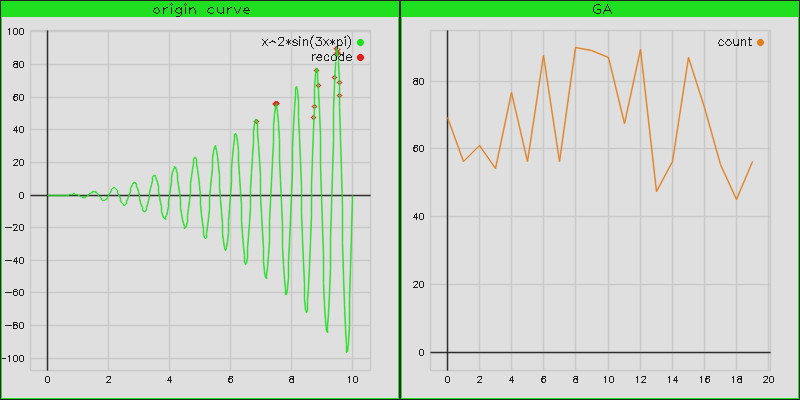
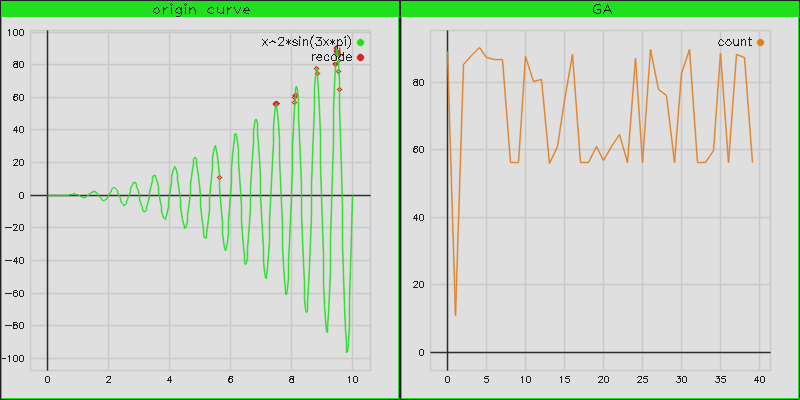
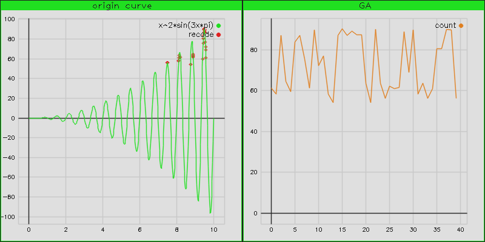
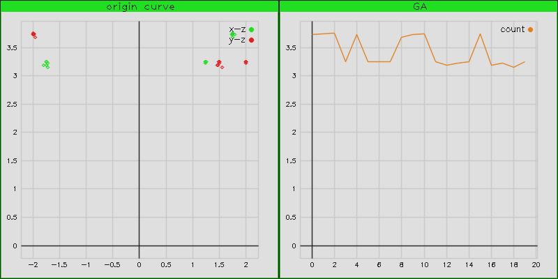
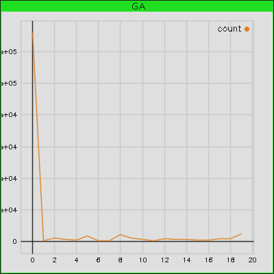
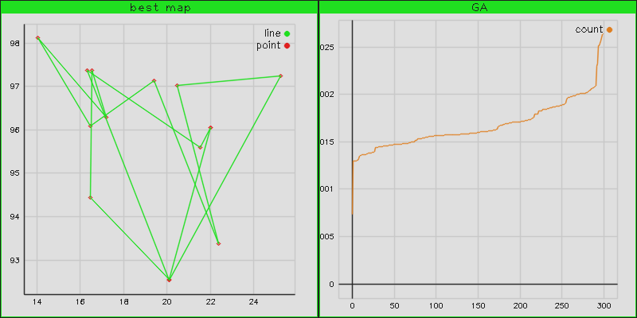

# GeneticAlgorithm
这是用C++写的遗传算法，参考《智能算法 30案例分析 第2版》一书，包含TSP、LQR控制器、结合量子算法、多目标优化、粒子群等，由于原作为matlab程序，综合自己思路通过C++写出来，算是练习和开个大坑


- 通过opencv绘制函数曲线图和坐标图
- 一元最优化目标
- 多元函数优化目标
- 基于遗传算法的BP神经网络（施工中）
- 基于遗传算法的TSP问题

## How to use
```
git clone https://github.com/ShiSanChuan/GeneticAlgorithm.git
cd GeneticAlgorithm/
cmake .
make -j4
cd src/
./GA
```

## Recode
### 一元函数优化
- 通过遗传算法求`x^2*sin(3x*pi)`的最大值，增大初始种群数目可加快迭代，增加种群基因编码长度增大迭代稳定性，变异和交叉较小为好;
- 对于遗传算法中的赌盘轮巡法，最常见直接计算所有个体函数的累加值作为随机值的最大值，但因为数据中可能有负数，所以将所有数据减去这个最小值，但这样结果会使中间的数据频繁出现，无法很好的表现最优值;
```cpp
float fun1(std::vector<float> argv){
	float x=argv[0];
	return (x*x*std::sin(3*pi*x));
}
...
ga.solve(fun1,1);
```




- 若再将fun(x)后处理的数据再次进行exp(x),可以去除有负数累加的问题，但若目标函数的最优值与次最优值很近，或者fun(x)的数据本身集中在[-inf,1]，也无法很好的区分最优值;



- 若将fun(x)后的数据进行排序，在将排序的大小换为整数1,...,n，在通过指数exp或者平方处理，可以很好区分最优值。



- 因为种群编码长度受计算机影响（64位），因此搜索区间太大会使精度下降，因此进行一次遗传算法寻求全局最优后再次缩小范围求获得的精度更高。

### 二元函数优化
- 与一元函数优化基本类似，不过在rank中需要在二元中需找对应最大解,求解`xcos(2pi*y)+ysin(2pi*x)`,该函数的matlab绘制的图像在第二张图片。
```cpp
float fun2(std::vector<float> argv){
	float x=argv[0];//参数可变，当前使用两个变量
	float y=argv[1];
	return (x*std::cos(2*pi*y)+y*std::sin(2*pi*x));
}
...
ga.solve(fun2,2);
```




### 基于BP的遗传算法
	BP的正则化在opencv中有点难弄。。所以结果误差MSE在4左右,BP中的sigmod函数的确非常重要。。。
```cpp
float _input[2][3]={{1,2,3},{4,5,6}};
float _output[2][2]={{1.,2.},{3.,4.}};
...
GA_BP ga(10,440);
ga.BPsolve(input, output);
```



### 基于遗传算法的TSP
- TSP作为典型的NP问题，目前没有一个多项式的解法，虽然参照书上matlab遗传算法求解TSP问题,但书中交叉、变异的概念有点没弄懂，用C++实现后，并没有出现预期想象中那么好的结果，或许这些NP问题用遗传算法来解有点看脸吧（：《 ），最好的结果也没有达到书中的0.03,实际距离29.3405（也就是包裹点的最大多边形）。

```cpp
float _address[14][3]={{16.47,96.10},{16.47,94.44},
						   {20.09,92.54},{22.39,93.37},
						   {25.23,97.24},{22.00,96.05},
						   {20.47,97.02},{17.20,96.29},
						   {16.30,97.38},{14.05,98.12},
						   {16.53,97.38},{21.52,95.59},
						   {19.41,97.13},{20.09,92.55}};
...
cv::Mat address(cv::Size(2,14),CV_32FC1,_address);
GA_TSP ga(40,address.rows);
ga.TSPsolve(address);
```


## some Problem
- 在每次选择最优种群个体时，保护当前最优个体加上赌盘选择法可以加快迭代优化，并且增加稳定。
- C++中构造函数中不能再使用其它重载的构造函数，会失效。
- cv::Mat 的结构体，使用at时，返回的是一个template的量，因此在使用逻辑表达式的时候最好先强制转换一下。
- 使用cstdarg，C++可变参数函数：(不过不如传入数组，因为cstdarg声明的函数指针不能使用lamdaba传入，一大遗憾。。)

```cpp
#include <cstdarg>
void testarg(count,...){
	va_list ap;
	va_start(ap, count);
	for(int i=0;i<count;i++)
	std::cout<<(int)va_arg(ap, int)<<std::endl;;
	va_end(ap);
	return;
}
```
- cv::Mat 使用colRange或者rowRange取行列，或者使用reshape函数重新设置行列，都是复制度为O(1)，同时获得的矩阵没有复制，而是引用，因此在操作在次处理后的矩阵，最好copyTo拷贝一份，重新赋值。