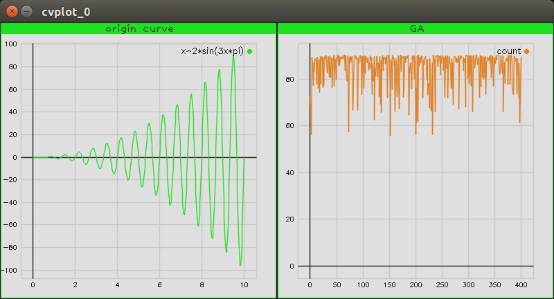

# GeneticAlgorithm
这是用C++写的遗传算法，参考《智能算法 30案例分析 第2版》一书，包含TSP、LQR控制器、结合量子算法、多目标优化、粒子群等，由于原作为matlab程序，综合自己思路通过C++写出来，算是练习和开个大坑


- 通过opencv绘制函数曲线图和坐标图

## How to use
	```cmake
	git clone https://github.com/ShiSanChuan/GeneticAlgorithm.git
	cd GeneticAlgorithm/
	cmake .
	make -j4
	cd src/
	./GA
	```

## Recode
	通过遗传算法求 `x^2*sin(3x*pi)`的最大值，增大初始种群数目可加快迭代，增加种群基因编码长度增大迭代稳定性，变异和交叉较小为好

